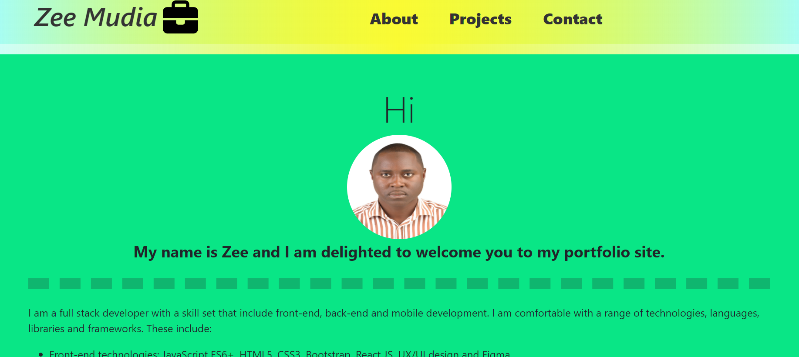

# Bootstrap Portfolio

## Description

This application is a static portfolio website featuring my skills, projects and contact information. This app was built based on a mockup designed with figma. [Check out](https://iosazee.github.io/Bootstrap-Portfolio/) the deployed application on github pages.

## Screenshots

## Usage

N/A

## License
This project is licensed under the MIT license. Read the fine print of [MIT license](https://opensource.org/licenses/MIT)

## Contact

If you have any questions you can contact me at [this email](iosazee1@gmail.com).

You can see more of my work at [my github's profile](https://github.com/iosazee).

This README was generated by [README-Generator](https://github.com/iosazee/README-Generator)

